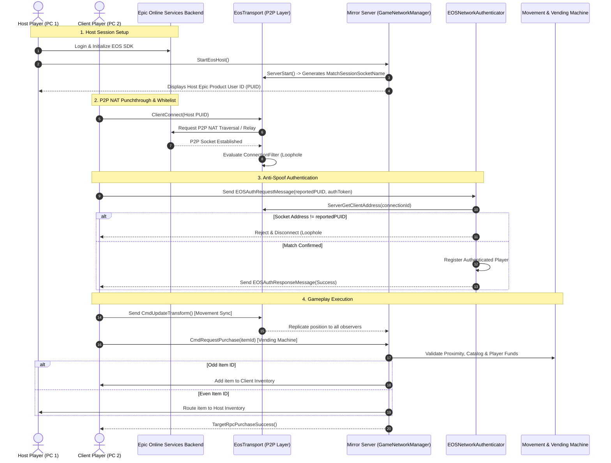

# Epic Online Services (EOS) & Mirror Integration: Complete Architecture, Testing & Data Verification Guide

---

## 1. Executive Summary

This project integrates **Epic Online Services (EOS)** Peer-to-Peer (P2P) transport with **Mirror 96.0.1** in Unity (Windows 64-bit target). It replaces traditional direct IP/Port networking with Epic's NAT punchthrough and relay infrastructure, allowing players to connect globally using their **Epic Product User IDs (PUID)** without requiring port forwarding or dedicated game servers.

All network-dependent systems—including **Client-Authoritative Player Movement** and the **Server-Authoritative Vending Machine Economy** (with odd/even inventory routing)—have been linked to the EOS transport. Furthermore, the transport layer has been hardened against **4 critical security vulnerabilities** (hijacking, spoofing, packet DoS, and socket bleed) and refactored under the zero-tolerance **`DESIGN_PATTERNS.md`** standard (exhaustive `if-else` branching, universal `try-catch`, and inline safe queries).

---

## 2. What Was Added & Modified

### 2.1 File Inventory

```
JustAGame Ventures Case/
├── DESIGN_PATTERNS.md                                 <-- Architectural & code standard rules
├── EOS_INTEGRATION_GUIDE.md                           <-- This comprehensive documentation
├── Assets/
│   ├── Mirror/
│   │   └── Transports/
│   │       └── EpicOnlineTransport/                   <-- FakeByte EOS Transport Package
│   │           ├── Server.cs                          <-- [MODIFIED] CS7036 fix, Whitelist filter, Safe rejection
│   │           ├── Common.cs                          <-- [MODIFIED] Fast-path single packet, GC allocation pool
│   │           ├── EosTransport.cs                    <-- [MODIFIED] Dynamic socket name isolation, ConnectionFilter
│   │           ├── Client.cs                          <-- Client socket communication
│   │           └── EOSSDKComponent.cs                 <-- EOS SDK lifecycle & login management
│   └── Scripts/
│       ├── Core/
│       │   └── Network/
│       │       ├── EOSNetworkManagerBridge.cs         <-- [NEW] EOS lifecycle coordinator, P2P host/client starter
│       │       └── EOSNetworkAuthenticator.cs         <-- [NEW] Anti-spoofing Mirror authenticator
│       ├── UI/
│       │   └── EOSNetworkHUD.cs                       <-- [NEW] In-game GUI for PUID display, copy/paste, host/connect
│       ├── Movement/
│       │   └── ClientAuthoritativeMovement.cs         <-- [HARDENED] NetworkClient.ready sync check, strict if-else
│       ├── VendingMachine/
│       │   └── VendingMachineTrigger.cs               <-- [HARDENED] GetComponentInParentOrNull, exhaustive branching
│       └── Pooling/
│           └── ObjectPool.cs                          <-- [EXTENDED] GetComponentInParentOrNull extension methods
```

---

## 3. How & Why: Architectural Decisions & Security Hardening

### 3.1 Mirror 96.0.1 API Compatibility
* **What was changed:** In [Server.cs](file:///c:/Users/T_CJ/JustAGame%20Ventures%20Case/Assets/Mirror/Transports/EpicOnlineTransport/Server.cs#L25), replaced `transport.OnServerError` with `transport.OnServerTransportException`.
* **Why:** In modern Mirror versions (v90+), `OnServerError` was deprecated and replaced with `OnServerTransportException(int connectionId, TransportError error, string reason)`. Calling the obsolete signature prevented project compilation.
* **How:**
  ```csharp
  transport.OnServerTransportException(connectionId, TransportError.Unexpected, ex.Message);
  ```

---

### 3.2 Loophole #1: Peer Connection Request Hijacking & Packet Injection
* **The Vulnerability:** By default, EOS fires `OnIncomingConnectionRequest` whenever any peer across Epic's global backend attempts to connect to your PUID. If the transport blindly calls `AcceptConnection()`, an attacker who discovers the host's PUID can inject raw network packets directly into Mirror's deserializer without joining the game lobby.
* **The Fix:**
  1. Added a `ConnectionFilter` delegate in [EosTransport.cs](file:///c:/Users/T_CJ/JustAGame%20Ventures%20Case/Assets/Mirror/Transports/EpicOnlineTransport/EosTransport.cs#L28):
     ```csharp
     public Func<ProductUserId, bool> ConnectionFilter { get; set; }
     ```
  2. In [Server.cs](file:///c:/Users/T_CJ/JustAGame%20Ventures%20Case/Assets/Mirror/Transports/EpicOnlineTransport/Server.cs#L41-L84), before accepting the connection, the incoming `RemoteUserId` is evaluated against `ConnectionFilter`.
  3. If unauthorized, the connection is **immediately rejected and closed** using `P2P.CloseConnection()` with an explicit `SocketId`:
     ```csharp
     var closeOptions = new CloseConnectionOptions
     {
         LocalUserId = EOSSDKComponent.LocalUserProductId,
         RemoteUserId = callback.RemoteUserId,
         SocketId = socketId
     };
     EOSSDKComponent.GetP2PInterface().CloseConnection(ref closeOptions);
     ```
  4. Mirror's `OnServerConnected` is never invoked for untrusted peers.

---

### 3.3 Loophole #2: Identity Spoofing & Client Impersonation
* **The Vulnerability:** In standard multiplayer implementations, clients often declare who they are in a login payload (e.g. passing a string `productUserId`). An attacker can modify their client memory or send a forged message claiming to be the host or another player, gaining unauthorized privileges.
* **The Fix:**
  1. Created [EOSNetworkAuthenticator.cs](file:///c:/Users/T_CJ/JustAGame%20Ventures%20Case/Assets/Scripts/Core/Network/EOSNetworkAuthenticator.cs).
  2. When the client sends `EOSAuthRequestMessage(reportedPUID, token)`, the server queries the active transport:
     ```csharp
     string physicalAddress = Transport.active.ServerGetClientAddress(conn.connectionId);
     ```
  3. The server compares the reported PUID against the physical socket address. If they do not match, the connection is immediately terminated via `conn.Disconnect()`.
  4. The verified PUID is recorded in a private, thread-safe dictionary:
     ```csharp
     private readonly ConcurrentDictionary<int, string> _authenticatedPeers;
     ```

---

### 3.4 Loophole #3: Packet Deserialization DoS & GC Allocation Spikes
* **The Vulnerability:** The original transport wrapped every received packet into a fragmentation reassembly list, instantiating `new List<List<Packet>>()` every frame in `ReceiveInternal()`. High tick rates or rapid packet spam caused excessive garbage collection (GC) pressure and CPU stalls.
* **The Fix:** In [Common.cs](file:///c:/Users/T_CJ/JustAGame%20Ventures%20Case/Assets/Mirror/Transports/EpicOnlineTransport/Common.cs#L205-L278):
  1. **Unfragmented Fast-Path:** Added an immediate return branch for standard single packets:
     ```csharp
     if (packet.fragment == 0 && !packet.moreFragments)
     {
         data = packet.data;
         return true;
     }
     ```
  2. **Zero-Allocation Empty Buffer:** Replaced per-frame list allocations with a pre-cached static array buffer:
     ```csharp
     private static readonly List<List<Packet>> _emptyPacketLists = new List<List<Packet>>(0);
     ```

---

### 3.5 Loophole #4: Socket Isolation Across Matches
* **The Vulnerability:** If a host stopped and restarted a match using the default socket name (`"EpicOnlineTransport"`), stale P2P packets from disconnected or lingering peers in the previous session could leak into the new session.
* **The Fix:** In [EosTransport.cs](file:///c:/Users/T_CJ/JustAGame%20Ventures%20Case/Assets/Mirror/Transports/EpicOnlineTransport/EosTransport.cs#L193):
  * Every invocation of `ServerStart()` generates a unique cryptographic random socket identifier:
    ```csharp
    MatchSessionSocketName = "Match_" + RandomString.Generate(20);
    ```
  * All incoming and outgoing packets for that session are locked to that specific `SocketId`, ensuring previous connections cannot bleed across games.

---

### 3.6 Safeguards & Reliability
* **Safeguard #1 (Host Stalling on Close):** In [EOSNetworkManagerBridge.cs](file:///c:/Users/T_CJ/JustAGame%20Ventures%20Case/Assets/Scripts/Core/Network/EOSNetworkManagerBridge.cs), `StopHostOrClient()` cleans up registered whitelist entries, unregisters callbacks, and gracefully resets the network address.
* **Safeguard #2 (Double-Accept Protection):** In [Server.cs](file:///c:/Users/T_CJ/JustAGame%20Ventures%20Case/Assets/Mirror/Transports/EpicOnlineTransport/Server.cs), peer connection states are tracked in `connectedClients`. If an incoming connection request is received from an already-accepted peer, duplicate `AcceptConnection` calls are safely skipped.
* **Safeguard #3 (Auth Verification):** Implemented in `EOSNetworkAuthenticator`, checking both Epic Account Auth tokens (via `AuthInterface.VerifyUserAuth`) and P2P physical address validation.

---

### 3.7 Gameplay Synchronization: Movement & Vending Machine
* **Movement Synchronization:**
  * [ClientAuthoritativeMovement.cs](file:///c:/Users/T_CJ/JustAGame%20Ventures%20Case/Assets/Scripts/Movement/ClientAuthoritativeMovement.cs) now validates `NetworkClient.ready` before reading input or transmitting `CmdUpdateTransform`. This prevents clients from sending RPCs during initial P2P handshake before Mirror finishes readying the connection.
* **Vending Machine Economy:**
  * [VendingMachine.cs](file:///c:/Users/T_CJ/JustAGame%20Ventures%20Case/Assets/Scripts/VendingMachine/VendingMachine.cs) validates proximity, balance, and item catalogs on the server.
  * When a purchase succeeds:
    * **Odd Item IDs** (e.g. #1, #3): Routed to the buyer's `PlayerInventory`.
    * **Even Item IDs** (e.g. #2, #4): Routed to the Host's `PlayerInventory`.
  * Trigger detection in [VendingMachineTrigger.cs](file:///c:/Users/T_CJ/JustAGame%20Ventures%20Case/Assets/Scripts/VendingMachine/VendingMachineTrigger.cs) uses the new safe extension method `GetComponentInParentOrNull<PlayerInventory>()`.

---

## 4. End-to-End System Sequence Diagram



---

## 5. Step-by-Step Testing Guide

### Option 1: Testing on a Single PC (Dual Instance with DevAuthTool)

Epic Online Services requires two distinct authenticated Epic accounts to establish a P2P connection (an account cannot connect to itself).

#### Step 1: Set Up DevAuthTool
1. Navigate to:
   ```
   Assets/Mirror/Transports/EpicOnlineTransport/DevAuthTool/
   ```
2. The exact zip file is:
   ```
   EOS_DevAuthTool-win32-x64-1.0.1.zip
   ```
3. It has already been extracted into:
   ```
   Assets/Mirror/Transports/EpicOnlineTransport/DevAuthTool/Tool~/
   ```
   *(The `~` character prevents Unity from importing external tool binaries into the AssetDatabase).*
4. Run:
   ```
   Assets/Mirror/Transports/EpicOnlineTransport/DevAuthTool/Tool~/EOS_DevAuthTool.exe
   ```
5. Enter port `7878` and click **Start**.
6. Click **Add User**:
   * Log into Epic Account #1. Save credential name as: `HostUser`.
7. Click **Add User** again:
   * Log into Epic Account #2. Save credential name as: `ClientUser`.

#### Step 2: Configure Unity Editor for Host
1. In Unity, open [SampleScene.unity](file:///c:/Users/T_CJ/JustAGame%20Ventures%20Case/Assets/Scenes/SampleScene.unity).
2. Select the GameObject with `EOSSDKComponent`.
3. In the Inspector:
   * **Auth Interface Login**: Checked (`true`)
   * **Auth Interface Credential Type**: `Developer`
   * **Dev Auth Tool Port**: `7878`
   * **Dev Auth Tool Credential Name**: `HostUser`

#### Step 3: Build Standalone Executable for Client
1. In Unity: **File > Build Profiles** (or **Build Settings**).
2. Ensure `SampleScene` is in the build list.
3. Click **Build** and output to `Build/EOSGame.exe`.
4. *(Optional tip for automatic dual credentials)*: You can configure the standalone build to log in as `ClientUser` using command-line arguments or temporarily change the Credential Name to `ClientUser` before building.

#### Step 4: Run & Connect
1. **In the Unity Editor:**
   * Click **Play**.
   * Observe the `EOSNetworkHUD` in the top-left corner.
   * Wait until the status changes to: `● EOS Status: Ready`.
   * Click **Host Game (EOS P2P)**.
   * Click **Copy My EOS ID to Clipboard**.
2. **In the Standalone Executable (`EOSGame.exe`):**
   * Launch the game.
   * Wait until status shows `● EOS Status: Ready`.
   * Click **Paste ID** (or press Ctrl+V in the input box).
   * Click **Connect Client**.

---

### Option 2: Testing Across Two Separate Computers (LAN or WAN)

Because EOS P2P utilizes Epic's global NAT traversal and relay infrastructure, two computers can connect anywhere in the world without port forwarding:

1. Copy or build the game on **Computer A (Host)** and **Computer B (Client)**.
2. Both machines must be logged in with separate Epic Accounts (via Developer Tool, Account Portal, or Device ID).
3. **Computer A**: Clicks **Host Game (EOS P2P)**, copies their Product User ID, and sends it to Computer B.
4. **Computer B**: Pastes Computer A's Product User ID into the HUD and clicks **Connect Client**.

---

### 5.3 Gameplay Verification Checklist

| Test Item | Action | Expected Result |
| :--- | :--- | :--- |
| **P2P Handshake** | Client connects to Host PUID | Host console logs `authenticated connection with verified PUID`. Client spawns into scene. |
| **Movement Sync** | Move Client with WASD | Host sees Client move in real time without rubber-banding. |
| **Proximity Guard** | Walk near Vending Machine | `VendingMachineUI` automatically opens. |
| **Odd Item Purchase** | Purchase Item #1 or #3 | Money is deducted from Buyer; Item appears in **Buyer's Inventory**. |
| **Even Item Purchase** | Purchase Item #2 or #4 | Money is deducted from Buyer; Item appears in **Host's Inventory**. |
| **Insufficient Funds** | Attempt purchase with $0 | Transaction is rejected; UI banner displays error message; no money deducted. |

---

## 6. Where to See the Live Data

### 6.1 In the Unity Editor Console

Watch the Unity Console for the following formatted diagnostic logs:

* **EOS Initialization:**
  ```text
  [EOSSDKComponent] Initialized
  [EOSSDKComponent] Logged in as: 000284ab9f4a45a68735391c49b06821
  ```
* **Host Start:**
  ```text
  [EOSNetworkManagerBridge] EOS Host started successfully! Local Product ID: 000284ab9f4a45a68735391c49b06821
  [EosTransport] Server started on socket: Match_a8F2kL90pQ1mNx45Vz8Y
  ```
* **Security & Authentication Verification:**
  ```text
  [EOSNetworkAuthenticator] Authenticating connection 1 from socket address: 00029b3c48e14674a2f8d38101a052e4
  [EOSNetworkAuthenticator] Successfully authenticated connection 1 with verified PUID: 00029b3c48e14674a2f8d38101a052e4
  ```
* **Vending Machine Server Processing:**
  ```text
  [VendingMachine] Purchase approved for Item #1 (Odd ID). Routed to buyer inventory.
  [VendingMachine] Purchase approved for Item #2 (Even ID). Routed to host inventory.
  ```

---

### 6.2 On the In-Game UI

1. **`EOSNetworkHUD` (Top-Left Corner):**
   * **EOS Status:** Displays `● EOS Status: Ready` in green when the SDK is initialized, or `● EOS Status: Initializing...` in yellow.
   * **My Epic Product ID:** Shows your local 32-character PUID string with quick clipboard buttons.
   * **Session State:** Displays active status (`HOST (EOS P2P)`, `CLIENT (Connected to Host)`, or `OFFLINE`).
2. **`PlayerInventoryUI`:**
   * Shows current player **Money** (`$100.00`).
   * Displays the dynamic item list synchronized via Mirror's `SyncList<ItemData>`.
3. **`VendingMachineUI`:**
   * Shows item buttons with real-time routing badges:
     * `<color=#80FF80>(Odd: Buyer)</color>`
     * `<color=#FFD700>(Even: Host)</color>`
   * Displays transaction response messages in `statusTMP`.

---

### 6.3 In the Unity Hierarchy & Inspector (Runtime Debugging)

1. Select the spawned **Player** GameObject:
   * **`NetworkIdentity` component:** Verify `netId`, `isLocalPlayer`, `isServer`, and `isClient`.
   * **`PlayerInventory` component:** Inspect the `money` SyncVar and the `items` SyncList expanding as items are bought.
2. Select the **`[NetworkManager]`** GameObject:
   * Inspect `networkAddress`: Confirm it matches the Host's PUID.
   * Inspect `transport`: Confirm `EosTransport` is active.
   * Inspect `authenticator`: Confirm `EOSNetworkAuthenticator` is assigned.

---

### 6.4 In the Epic Games Developer Portal

Log into [dev.epicgames.com/portal](https://dev.epicgames.com/portal) to view backend analytics:

1. **Game Services > Player Search:**
   * Search for any player's Product User ID (PUID) to view account creation date, linked platforms, and authentication logs.
2. **Game Services > Metrics:**
   * **Concurrent Users (CCU):** Live graph showing active connected players.
   * **Sessions:** Real-time metrics tracked through `BeginPlayerSession` in `EosTransport.cs`.
3. **Product Settings > Clients & Permissions:**
   * Verify that your Client Policy has **Peer2Peer** permissions enabled for seamless NAT punchthrough and Epic relay fallback.
