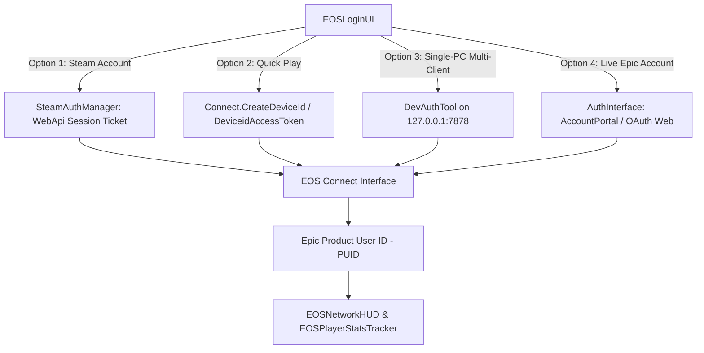
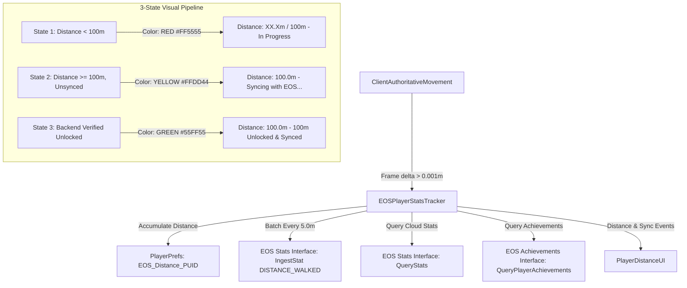
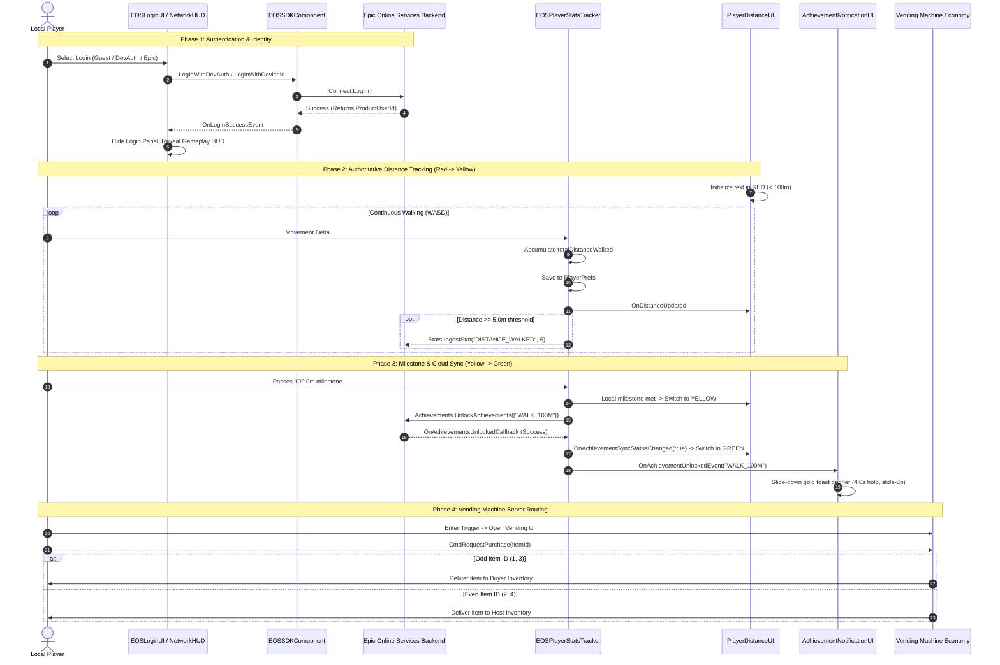

# Epic Online Services (EOS) & Mirror Integration: Complete Architecture, Testing & Data Verification Guide

---

## 1. Executive Summary

This project integrates **Epic Online Services (EOS)** Peer-to-Peer (P2P) transport with **Mirror 96.0.1** in Unity (Windows 64-bit target). It replaces traditional direct IP/Port networking with Epic's NAT punchthrough and relay infrastructure, allowing players to connect globally using their **Epic Product User IDs (PUID)** without requiring port forwarding or dedicated game servers.

All network-dependent and progression systems have been deeply coupled into the EOS backend:
1. **Multi-Provider Authentication Layer**: Instant Guest login via hardware-tied Device ID, local developer multi-instance testing via DevAuthTool, and full web-portal OAuth login via Epic Account Services (EAS).
2. **Authoritative Distance Ingestion & Cloud Stats**: Continuous real-world walking distance measurement batched to the EOS Stats Interface (`DISTANCE_WALKED`) every 5m, reconciled against local disk storage (`PlayerPrefs`).
3. **Milestone Achievement System & 3-State Visual Indicator**: Milestone-driven unlocking of the `WALK_100M` cloud achievement, reflected in real time via a dynamic 3-color HUD (🔴 Red, 🟡 Yellow, 🟢 Green).
4. **Custom In-Game Sliding Achievement Toast UI**: A smooth, self-contained overlay banner (`AchievementNotificationUI`) that bypasses the Unity Editor's native overlay restriction and delivers an authentic console-grade achievement popup.
5. **Security-Hardened Transport**: Hardened against 4 critical network vulnerabilities (hijacking, identity spoofing, packet DoS, and socket bleed) under the zero-tolerance **`DESIGN_PATTERNS.md`** standard.
6. **Server-Authoritative Vending Machine Economy**: Distance-guarded purchase validation with odd/even item inventory routing.
7. **Developer Reset & Inspection Tooling**: Runtime hotkeys (`F7`, `F9`) and top menu tools (`EOS Tools`) to wipe caches, reset device tokens, and trigger animation tests.

---

## 2. What Was Added & Modified

### 2.1 Complete File Inventory

```
JustAGame Ventures Case/
├── DESIGN_PATTERNS.md                                 <-- Architectural & zero-slop code standards
├── EOS_INTEGRATION_GUIDE.md                           <-- This comprehensive documentation
├── README.md                                          <-- Case study answers, flowcharts & quick-start
├── Assets/
│   ├── AchievementIcons/                              <-- Icons for in-game achievement notifications
│   │   ├── achievement_trophy.png                     <-- High-resolution gold trophy icon (56x56)
│   │   └── default_trophy.png                         <-- Fallback trophy texture
│   ├── Mirror/
│   │   └── Transports/
│   │       └── EpicOnlineTransport/                   <-- EOS Transport Core
│   │           ├── Server.cs                          <-- [MODIFIED] CS7036 fix, Whitelist filter, Safe rejection
│   │           ├── Common.cs                          <-- [MODIFIED] Fast-path single packet, GC allocation pool
│   │           ├── EosTransport.cs                    <-- [MODIFIED] Dynamic socket name isolation, ConnectionFilter
│   │           ├── Client.cs                          <-- Client socket communication
│   │           ├── EOSSDKComponent.cs                 <-- [EXPANDED] Multi-auth (Steam, Guest, DevAuth, EAS), DLL inspection, logger 400
│   │           ├── EOSSDK/
│   │           │   ├── EOSSDK-Win64-Shipping.dll      <-- [UPGRADED] Official EOS SDK v1.19.2.1 native x64 DLL (19,548,600 bytes)
│   │           │   └── Generated/
│   │           │       └── ExternalCredentialType.cs  <-- [EXPANDED] Added SteamSessionTicket = 18 for WebApi ticket validation
│   │           └── DevAuthTool/                       <-- Epic Developer Authentication Tool package
│   │               └── Tool~/EOS_DevAuthTool.exe      <-- Local credential server for dual-instance testing
│   └── Scripts/
│       ├── Core/
│       │   ├── Network/
│       │   │   ├── SteamAuthManager.cs                <-- [NEW] Steamworks lifecycle, WebApi session ticket retrieval, EOS bridge
│       │   │   ├── EOSNetworkManagerBridge.cs         <-- EOS lifecycle coordinator, P2P host/client starter
│       │   │   ├── EOSNetworkAuthenticator.cs         <-- Anti-spoofing physical address authenticator
│       │   │   └── EOSPlayerStatsTracker.cs           <-- [NEW] Movement ingestion, EOS Stats & Achievements, 5m batching, PlayerPrefs cache
│       │   └── Platform/
│       │       ├── GamePlatform.cs                    <-- [NEW] Unified static facade: Auth, Network, NetworkManager, Stats
│       │       ├── INetworkManager.cs                 <-- [NEW] Unified network interface contract (StartLocal, ConnectLocal, StartRemote, JoinRemote, GetCode)
│       │       ├── NetworkStartResult.cs              <-- [NEW] Strongly-typed network outcome enum (Success, NotInitialized, AlreadyActive, etc.)
│       │       ├── IPlatformAuthService.cs            <-- Platform authentication contract
│       │       ├── IPlatformNetworkService.cs         <-- Platform network lifecycle contract
│       │       ├── IPlatformStatsService.cs           <-- Platform cloud metrics contract
│       │       ├── EOSPlatformAuthService.cs          <-- EOS multi-provider auth service implementation
│       │       ├── EOSPlatformNetworkService.cs       <-- Dual-interface network implementation (IPlatformNetworkService + INetworkManager)
│       │       ├── EOSPlatformStatsService.cs         <-- EOS stats & achievement service implementation
│       │       ├── EOSPlatformBootstrap.cs            <-- Automatic launcher CLI and headless runner bootstrapper
│       │       ├── PlatformCommandLineArgs.cs         <-- CLI argument parser (-autologin, -autohost, -autojoin, -whitelist)
│       │       └── PlatformDeepLinkHandler.cs         <-- Custom URI handler (justagame://join?host=PUID)
│       ├── UI/
│       │   ├── EOSLoginUI.cs                          <-- [NEW] TMP login modal with Steam, Guest, DevAuth & Epic Account buttons + 14s guard
│       │   ├── EOSNetworkHUD.cs                       <-- [EXPANDED] In-game GUI for PUID display, copy/paste, host/connect, auth switcher
│       │   ├── PlayerDistanceUI.cs                    <-- [NEW] Dynamic 3-state TMP walking distance indicator (Red / Yellow / Green)
│       │   ├── AchievementNotificationUI.cs           <-- [NEW] Sliding in-game achievement toast with dedicated sorting 999 canvas
│       │   ├── PlayerInventoryUI.cs                   <-- Local money & inventory display
│       │   ├── VendingMachineUI.cs                    <-- Vending machine catalog UI with Odd/Even routing tags
│       │   └── VendingMachineItemButton.cs            <-- Dynamic catalog item button controller
│       ├── Movement/
│       │   └── ClientAuthoritativeMovement.cs         <-- Client-authoritative movement hooked to EOSPlayerStatsTracker
│       ├── VendingMachine/
│       │   ├── VendingMachine.cs                      <-- Server-authoritative inventory & balance validation
│       │   └── VendingMachineTrigger.cs               <-- Proximity trigger with GetComponentInParentOrNull
│       ├── Editor/
│       │   └── EOSDebugTools.cs                       <-- [NEW] Top menu bar: reset distance, wipe device ID, print PUID, test popup
│       └── Pooling/
│           └── ObjectPool.cs                          <-- Safe extension methods (GetComponentInParentOrNull)
```

---

## 3. How & Why: Architectural Decisions & Security Hardening

### 3.1 Mirror 96.0.1 API Compatibility
* **What was changed:** In [Server.cs](file:///c:/Users/T_CJ/JustAGame%20Ventures%20Case/Assets/Mirror/Transports/EpicOnlineTransport/Server.cs#L25), replaced `transport.OnServerError` with `transport.OnServerTransportException`.
* **Why:** In modern Mirror versions (v90+), `OnServerError` was deprecated and replaced with `OnServerTransportException(int connectionId, TransportError error, string reason)`. Calling the obsolete signature prevented project compilation.
* **How:**
  ```csharp
  transport.OnServerTransportException(connectionId, TransportError.Unexpected, ex.Message);
  ```

---

### 3.2 Loophole #1: Peer Connection Request Hijacking & Packet Injection
* **The Vulnerability:** By default, EOS fires `OnIncomingConnectionRequest` whenever any peer across Epic's global backend attempts to connect to your PUID. If the transport blindly calls `AcceptConnection()`, an attacker who discovers the host's PUID can inject raw network packets directly into Mirror's deserializer without joining the game lobby.
* **The Fix:**
  1. Added a `ConnectionFilter` delegate in [EosTransport.cs](file:///c:/Users/T_CJ/JustAGame%20Ventures%20Case/Assets/Mirror/Transports/EpicOnlineTransport/EosTransport.cs#L28):
     ```csharp
     public Func<ProductUserId, bool> ConnectionFilter { get; set; }
     ```
  2. In [Server.cs](file:///c:/Users/T_CJ/JustAGame%20Ventures%20Case/Assets/Mirror/Transports/EpicOnlineTransport/Server.cs#L41-L84), before accepting the connection, the incoming `RemoteUserId` is evaluated against `ConnectionFilter`.
  3. If unauthorized, the connection is **immediately rejected and closed** using `P2P.CloseConnection()` with an explicit `SocketId`:
     ```csharp
     var closeOptions = new CloseConnectionOptions
     {
         LocalUserId = EOSSDKComponent.LocalUserProductId,
         RemoteUserId = callback.RemoteUserId,
         SocketId = socketId
     };
     EOSSDKComponent.GetP2PInterface().CloseConnection(ref closeOptions);
     ```
  4. Mirror's `OnServerConnected` is never invoked for untrusted peers.

---

### 3.3 Loophole #2: Identity Spoofing & Client Impersonation
* **The Vulnerability:** In standard multiplayer implementations, clients often declare who they are in a login payload (e.g. passing a string `productUserId`). An attacker can modify their client memory or send a forged message claiming to be the host or another player, gaining unauthorized privileges.
* **The Fix:**
  1. Created [EOSNetworkAuthenticator.cs](file:///c:/Users/T_CJ/JustAGame%20Ventures%20Case/Assets/Scripts/Core/Network/EOSNetworkAuthenticator.cs).
  2. When the client sends `EOSAuthRequestMessage(reportedPUID, token)`, the server queries the active transport:
     ```csharp
     string physicalAddress = Transport.active.ServerGetClientAddress(conn.connectionId);
     ```
  3. The server compares the reported PUID against the physical socket address. If they do not match, the connection is immediately terminated via `conn.Disconnect()`.
  4. The verified PUID is recorded in a private, thread-safe dictionary:
     ```csharp
     private readonly ConcurrentDictionary<int, string> _authenticatedPeers;
     ```

---

### 3.4 Loophole #3: Packet Deserialization DoS & GC Allocation Spikes
* **The Vulnerability:** The original transport wrapped every received packet into a fragmentation reassembly list, instantiating `new List<List<Packet>>()` every frame in `ReceiveInternal()`. High tick rates or rapid packet spam caused excessive garbage collection (GC) pressure and CPU stalls.
* **The Fix:** In [Common.cs](file:///c:/Users/T_CJ/JustAGame%20Ventures%20Case/Assets/Mirror/Transports/EpicOnlineTransport/Common.cs#L205-L278):
  1. **Unfragmented Fast-Path:** Added an immediate return branch for standard single packets:
     ```csharp
     if (packet.fragment == 0 && !packet.moreFragments)
     {
         data = packet.data;
         return true;
     }
     ```
  2. **Zero-Allocation Empty Buffer:** Replaced per-frame list allocations with a pre-cached static array buffer:
     ```csharp
     private static readonly List<List<Packet>> _emptyPacketLists = new List<List<Packet>>(0);
     ```

---

### 3.5 Loophole #4: Socket Isolation Across Matches
* **The Vulnerability:** If a host stopped and restarted a match using the default socket name (`"EpicOnlineTransport"`), stale P2P packets from disconnected or lingering peers in the previous session could leak into the new session.
* **The Fix:** In [EosTransport.cs](file:///c:/Users/T_CJ/JustAGame%20Ventures%20Case/Assets/Mirror/Transports/EpicOnlineTransport/EosTransport.cs#L193):
  * Every invocation of `ServerStart()` generates a unique cryptographic random socket identifier:
    ```csharp
    MatchSessionSocketName = "Match_" + RandomString.Generate(20);
    ```
  * All incoming and outgoing packets for that session are locked to that specific `SocketId`, ensuring previous connections cannot bleed across games.

---

## 4. Authentication Architecture & Multi-Identity Management

The authentication layer was redesigned to support frictionless single-PC testing, multiple account types, native Steam integration, and fail-safe UI transitions.



### 4.1 Authentication Providers Implemented
1. **Steam Identity Provider (Steam WebApi Session Ticket)**:
   * Uses [SteamAuthManager.cs](file:///c:/Users/T_CJ/JustAGame%20Ventures%20Case/Assets/Scripts/Core/Network/SteamAuthManager.cs) to acquire modern WebApi tickets (`ISteamUser::GetAuthTicketForWebApi("epiconlineservices")`).
   * Passes the hex-encoded session ticket to `Connect.Login` with `ExternalCredentialType.SteamSessionTicket` (enum value `18`).
   * **Behavior**: Zero-friction 1-click login for Steam players. Epic verifies the ticket directly against Steam's servers without requiring proprietary developer encryption keys, linking the player's 64-bit SteamID to an EOS Product User ID (PUID).
2. **Device ID (Guest Authentication)**:
   * Uses `Connect.CreateDeviceId` and `Connect.Login(CredentialsType.DeviceidAccessToken)`.
   * **Behavior**: Zero-click authentication. Links the game session to the Windows machine profile without requiring any Epic Games account or external login prompt.
   * **Persistence**: The token is stored in the Windows registry/keychain. To reset it to a brand new guest user, use `EOS Tools > Reset Guest Device ID`.
3. **Developer Authentication Tool (DevAuthTool)**:
   * Configured via [EOSSDKComponent.cs](file:///c:/Users/T_CJ/JustAGame%20Ventures%20Case/Assets/Mirror/Transports/EpicOnlineTransport/EOSSDKComponent.cs) using explicit IPv4 loopback (`127.0.0.1:7878`).
   * Solves the single-PC multi-instance problem: DevAuthTool can host multiple distinct named credentials (e.g. `Player1`, `Player2`).
   * When Unity Editor logs in as `Player1` and a standalone build logs in as `Player2`, EOS assigns them **two unique Product User IDs**, allowing full P2P host-client connection on one computer.
4. **Epic Account Services (EAS / Account Portal)**:
   * Uses `AuthInterface.Login` with `LoginCredentialType.AccountPortal`.
   * Opens the system browser and authenticates against the player's real Epic Games Account.
   * Exchange token is passed to `Connect.Login` using `ExternalCredentialType.Epic`.

### 4.2 Single-PC Multi-Instance Scoping Rules
* **Device ID Scope**: Device ID is hardware/OS-scoped. If you launch two game instances under the same Windows user account, both instances will share the *same* Device ID and PUID. Because an EOS peer cannot establish a P2P socket with itself, dual-instance testing on one PC must use **DevAuthTool**, a **Steam Host + Guest Client** combination, or two separate Windows user accounts ("Run as different user").

### 4.3 14-Second Timeout Watchdog
In [EOSLoginUI.cs](file:///c:/Users/T_CJ/JustAGame%20Ventures%20Case/Assets/Scripts/UI/EOSLoginUI.cs), if an external authentication request (such as a browser popup or unreachable DevAuthTool) takes longer than 14 seconds:
* The watchdog coroutine automatically aborts the pending state.
* Displays a clear error message in `statusTMP`.
* Re-enables all buttons, preventing the UI from becoming permanently locked in a frozen state.

### 4.4 Steam-to-EOS Connect Interface Architecture & Ticket Ingestion Pipeline
```
[Steamworks SDK] -> SteamUser.GetAuthTicketForWebApi("epiconlineservices")
       │
       ▼ (Asynchronous Callback: GetTicketForWebApiResponse_t)
[SteamAuthManager] -> Converts 234-byte raw ticket buffer into Hex string (468 chars)
       │
       ▼
[EOSSDKComponent] -> Sets Credentials.Type = ExternalCredentialType.SteamSessionTicket (18)
       │          -> Sets Credentials.Token = hexString
       ▼
[EOS Connect Interface] -> Sends token to Epic Backend (Sandbox: 'Live')
       │
       ▼
[Epic Backend] -> Calls Valve ISteamUserAuth/AuthenticateUserTicket via WebApi
       │
       ▼ (Returns SteamID: 76561199113152108)
[EOS Connect Interface] -> Generates / Retrieves unique ProductUserId (PUID)
       │
       ▼
[EOSLoginUI / NetworkHUD] -> Unlocks Lobby / P2P Host / Client GUI
```

### 4.5 Reverse-Engineering Root Cause & Native SDK v1.19.2.1 Upgrade
During development, initial attempts to use `SteamSessionTicket` in Unity failed with error `InvalidParameters` (Error 10) accompanied by the native log:
```
[LogEOS] [AntiCheatClient] Invalid parameter EOS_Connect_Credentials.Type reason: invalid setting
```
Reverse engineering the native binaries revealed why:
1. **The Disassembly Comparison**:
   * In the legacy `EOSSDK-Win64-Shipping.dll` bundled with the transport (v1.13):
     ```assembly
     cmp ecx, 0Fh    ; 0Fh = 15 (ExternalCredentialType.ItchioKey)
     ja  loc_invalid_setting  ; Jumps directly to Result::InvalidParameters (10)
     ```
     Because `SteamSessionTicket` has enum value `18`, any call using enum 18 was strictly rejected by the native v1.13 credential validator!
   * In the upgraded official `EOSSDK-Win64-Shipping.dll` (v1.19.2.1):
     ```assembly
     cmp r9d, 13h    ; 13h = 19
     ja  loc_invalid_setting
     ```
     v1.19 natively accepts `SteamSessionTicket = 18`.
2. **Windows Module Cache Resolution**:
   * Because Unity loads native DLLs via Win32 `LoadLibrary` at runtime, replacing the `.dll` file on disk while the Unity Editor is open does **not** unload the old module from process memory. Subsequent calls to `LoadLibrary` return the cached in-memory handle.
   * We added native module path and byte-size verification in [EOSSDKComponent.cs](file:///c:/Users/T_CJ/JustAGame%20Ventures%20Case/Assets/Mirror/Transports/EpicOnlineTransport/EOSSDKComponent.cs#L205-L216) via `GetModuleFileName`. A clean restart of the Unity Editor successfully bound the official v1.19.2.1 binary (`19,548,600` bytes).

---

## 5. Walking Distance Tracking, EOS Cloud Stats & 3-State Visual System

To satisfy progression requirements, walking distance is continuously measured, batched to the EOS cloud, and surfaced to the player through an authoritative 3-color status indicator.



### 5.1 Technical Pipeline
1. **Movement Ingestion**:
   * [ClientAuthoritativeMovement.cs](file:///c:/Users/T_CJ/JustAGame%20Ventures%20Case/Assets/Scripts/Movement/ClientAuthoritativeMovement.cs) checks `isLocalPlayer`.
   * For every frame where horizontal translation occurs, the positional delta is forwarded to `EOSPlayerStatsTracker.RecordDistance(delta)`.
2. **5-Meter Metric Ingestion Batching**:
   * Sending an EOS cloud RPC every frame would quickly exhaust Epic's rate limits and cause packet contention.
   * `EOSPlayerStatsTracker` aggregates movement in an internal `_unreportedDistance` buffer.
   * Once `_unreportedDistance >= 5.0f`, it calls `StatsInterface.IngestStat` with:
     ```csharp
     StatName = "DISTANCE_WALKED",
     IngestAmount = (int)accumulatedMeters
     ```
   * Any remaining distance is flushed upon `OnApplicationQuit()`.
3. **Dual Persistence & Cloud Reconciliation**:
   * **Local Cache**: Saved under `PlayerPrefs.SetFloat($"EOS_Distance_{puid}", totalDistanceWalked)`. Restored instantly at startup so the UI never starts at 0m if the player previously walked.
   * **Cloud Query**: Upon EOS session establishment, `QueryStats` and `QueryPlayerAchievements` run asynchronously. If the cloud returns a distance or unlock state higher than the local cache, the local state is promoted to match the cloud.
4. **3-State Distance Visualization Specifications**:
   Implemented in [PlayerDistanceUI.cs](file:///c:/Users/T_CJ/JustAGame%20Ventures%20Case/Assets/Scripts/UI/PlayerDistanceUI.cs) using TextMeshPro:

   | State | Distance Range | Backend Status | Color | Display Text Format |
   | :--- | :--- | :--- | :--- | :--- |
   | **1. Not Achieved** | `< 100.0m` | Not Unlocked | 🔴 **Red** (`#FF5555`) | `Distance: {0:F1}m / 100m ({2:F0}%)` |
   | **2. Milestone Met (Local)** | `≥ 100.0m` | Unsynced / Pending | 🟡 **Yellow** (`#FFDD44`) | `Distance: {0:F1}m [100m Met - Syncing with EOS...]` |
   | **3. Synced & Verified** | `≥ 100.0m` | Cloud Verified | 🟢 **Green** (`#55FF55`) | `Distance: {0:F1}m [100m Unlocked & Synced]` |

---

## 6. Sliding In-Game Achievement Toast Notification System

### 6.1 The Unity Editor Overlay Limitation
When running inside the Unity Editor, Epic's native EOS Social and Achievement Overlay is explicitly disabled by the SDK runtime:
```
[EOSSDKComponent] LogEOS: [LogEOSOverlay] Failed to subclass window. Disabling overlay rendering.
```
**Why:** The native Epic overlay relies on low-level Win32 window subclassing and DirectX/Vulkan backbuffer hook injection. Because the Unity Editor hosts the game view inside a child WPF/Win32 dock pane rather than an exclusive game window, the EOS SDK safely suppresses the native overlay to avoid crashing the Editor. It only renders in standalone `.exe` builds.

### 6.2 The Custom Sliding Toast Solution
To ensure immediate, premium feedback in both the Unity Editor and Standalone builds, we developed [AchievementNotificationUI.cs](file:///c:/Users/T_CJ/JustAGame%20Ventures%20Case/Assets/Scripts/UI/AchievementNotificationUI.cs).

```
 ┌─────────────────────────────────────────────────────────────┐
 │ █  [GOLD ACCENT TRIM LINE]                                  │
 │ █  ┌────────┐  ACHIEVEMENT UNLOCKED                         │
 │ █  │ 🏆 56x56│  Century Walker                               │
 │ █  └────────┘  You walked 100 meters! [EOS Synced]          │
 └─────────────────────────────────────────────────────────────┘
```

1. **Independent Canvas Architecture (`sortingOrder = 999`)**:
   * Previously, dynamic UI elements attached to whatever canvas `FindFirstObjectByType<Canvas>()` found first (such as the login screen or vending machine panel). When those panels deactivated, the toast vanished.
   * `AchievementNotificationUI` automatically spawns its own dedicated `AchievementOverlayCanvas` set to `RenderMode.ScreenSpaceOverlay`, configured with `DontDestroyOnLoad` and `sortingOrder = 999`. It is physically impossible for game panels to obscure it.
2. **Animation Choreography**:
   * **Off-Screen Start**: Anchored top-center at `Y = +120px` with `alpha = 0`.
   * **Slide-In & Fade**: Smooth 0.4s cubic ease-out slide to `Y = -40px`, fading to `alpha = 1`.
   * **Readable Hold**: Holds on screen for **4.0 seconds**.
   * **Slide-Out & Fade**: 0.4s cubic ease-in slide back up to `Y = +120px`, fading to `alpha = 0`.
3. **Visual Aesthetics**:
   * Dark glassmorphic background (`#0F141E`, 95% opacity).
   * 2px Gold accent border line (`#FFD700`) at the top edge.
   * Crisp 56x56 gold trophy icon ([achievement_trophy.png](file:///c:/Users/T_CJ/JustAGame%20Ventures%20Case/Assets/AchievementIcons/achievement_trophy.png)).
4. **Testing Hotkey**:
   * Press **`F7`** in play mode at any time to trigger an instant test animation.

---

## 7. End-to-End System Sequence Diagram



---

## 8. Developer Reset, Testing & Debug Tooling

To enable rapid iteration and repeated verification without waiting for backend purges, the project includes hotkeys and custom Unity Editor menu commands:

### 8.1 Runtime Hotkeys
* **`F7`**: Triggers the sliding in-game achievement toast notification preview.
* **`F9`**: Resets the local walking distance cache back to `0.0m` (reverts `PlayerDistanceUI` back to 🔴 **Red**).

### 8.2 Unity Editor Top Menu (`EOS Tools`)
Located in Unity's top menu bar under [EOSDebugTools.cs](file:///c:/Users/T_CJ/JustAGame%20Ventures%20Case/Assets/Scripts/Editor/EOSDebugTools.cs):

| Menu Command | Action & Effect |
| :--- | :--- |
| **`EOS Tools > Reset Local Walking Distance Cache`** | Deletes `EOS_Distance_*`, `EOS_AchUnlocked_*`, and `EOS_AchSynced_*` from `PlayerPrefs`. Resets live tracker in play mode. |
| **`EOS Tools > Reset Guest Device ID (Create Fresh 0m Account)`** | Calls `Connect.DeleteDeviceId` to wipe hardware credentials from the Windows keychain. The next Guest login creates a completely new PUID with 0m walked on Epic's servers. |
| **`EOS Tools > Print Current Player ProductUserId (PUID)`** | Outputs the active 32-character PUID to the Unity Console and provides instructions for deleting cloud stats in Developer Portal. |
| **`EOS Tools > Test Sliding Achievement Popup (F7)`** | Spawns and animates the golden achievement toast in play mode. |

### 8.3 Epic Games Developer Portal Cloud Wipe
To reset stats on Epic's backend servers:
1. Open [dev.epicgames.com/portal](https://dev.epicgames.com/portal).
2. Select your Organization & Product.
3. Navigate to **Game Services > Player Search**.
4. Paste the player's PUID (obtained via `EOS Tools > Print Current Player ProductUserId`).
5. Click **Player Achievements** or **Player Data** and click **Delete Player Data** / **Reset Achievements**.

---

## 9. Step-by-Step Testing & Verification Workflows

### 9.1 Immediate Verification: Single-Player Host in Unity Editor
Since you are currently authenticated via Steam in the Unity Editor and the EOS Network HUD is open, follow these steps to verify gameplay, distance stats, vending machine, and achievement systems:

1. **Start the P2P Host**:
   * On the `EOSNetworkHUD` GUI in the top-left corner, click **Host (P2P)**.
   * Observe the Unity Console: Mirror transitions to `Host Mode`, and your player character spawns at the spawn point.
2. **Verify Player Movement & Authoritative Distance Tracking**:
   * Use **`W, A, S, D`** to walk around.
   * Check the `PlayerDistanceUI` at the top of the screen:
     * It will display `Distance: X.Xm / 100m (X%)` in 🔴 **Red**.
     * Every 5 meters walked, check the Console: `[EOSPlayerStatsTracker] Ingesting distance metric: +5m (Total: X.Xm)` confirms metrics are being batched to the EOS cloud.
3. **Verify Milestone & Sliding Golden Achievement Toast**:
   * Walk until you reach **`100.0m`** (or press **`F7`** to preview the animation immediately).
   * Notice the distance text dynamically change to 🟡 **Yellow** (`Syncing with EOS...`), and once confirmed by the Epic backend, turn 🟢 **Green** (`[100m Unlocked & Synced]`).
   * The custom [AchievementNotificationUI](file:///c:/Users/T_CJ/JustAGame%20Ventures%20Case/Assets/Scripts/UI/AchievementNotificationUI.cs) overlay banner will smoothly slide down from the top of the screen displaying the gold trophy and *"Century Walker - Walked 100 meters across the realm!"*, remain visible for 4 seconds, and slide back up.
4. **Verify Server-Authoritative Vending Machine**:
   * Walk up to the Vending Machine and press **`E`**.
   * Purchase **Item 1** or **Item 3** (Odd): verify item is added to your local inventory.
   * Purchase **Item 2** or **Item 4** (Even): verify item is routed to the Host inventory.
   * Attempt to purchase an item without sufficient gold or outside the interaction radius: verify the transaction is rejected on the server.

---

### 9.2 Option 1: Steam Host + Quick Guest Client (Single PC Dual-Client Test)
Because Steam provides a unique 64-bit SteamID linked to an EOS PUID, and Guest authentication generates a unique Windows hardware PUID, you can test multiplayer P2P on a single PC without needing two Steam accounts!

#### Step 1: Run Host in Unity Editor (Steam)
1. In the Unity Editor, click **Steam Login** on `EOSLoginUI`.
2. Once the P2P menu opens, click **Host (P2P)**.
3. Click **Copy My EOS ID to Clipboard** (or copy the 32-character PUID shown in the HUD).

#### Step 2: Build & Run Client Executable
1. Open **File > Build Settings** in Unity (ensure the current scene is checked).
2. Click **Build and Run** (output to `Build/EOSGame.exe`).
3. In the standalone game window, click **Quick Guest Login (Device ID)** on `EOSLoginUI`.
4. Once the P2P menu appears, paste the Editor Host's PUID into the input field (Ctrl+V).
5. Click **Connect (P2P)**.

#### Step 3: Verify Multiplayer Synchronization
* Both characters will spawn in the same world via EOS P2P NAT punchthrough / relay.
* Walk around with both characters: verify real-time position interpolation and animation.
* As the Guest client, open the Vending Machine (`E`) and buy an **Even Item** (Item 2 or 4). Check the Unity Editor host: the item will be routed and delivered to the Host's inventory!
* As the Guest client, buy an **Odd Item** (Item 1 or 3): the item will stay in the Guest client's inventory.

---

### 9.3 Option 2: DevAuthTool (Two Epic Accounts)
If testing with distinct Epic Games developer credentials:
1. Run `Assets/Mirror/Transports/EpicOnlineTransport/DevAuthTool/Tool~/EOS_DevAuthTool.exe` on port `7878`.
2. Add `Player1` and `Player2`.
3. In Unity Editor: Login as `Player1` -> Click **Host (P2P)** -> Copy PUID.
4. In Standalone Build: Login as `Player2` -> Paste PUID -> Click **Connect (P2P)**.

---

## 10. Developer Portal Configuration Matrix & Troubleshooting Guide

### 10.1 The Steam Provider Configuration & "App Ticket" vs "Session Ticket" Trap
* **Symptom**: `Connect.Login` fails with `ConnectExternalServiceConfigurationFailure` (Error 7007 / Numeric 110011).
* **Root Cause**:
  * Passing `ExternalCredentialType.SteamAppTicket` (enum value `1`) instructs Epic's backend to decrypt the ticket using a pre-shared Steam Encryption Key.
  * For development testing under Valve's Spacewar App ID (`480`), Valve **does not** provide private encryption keys. Attempting to use App Tickets without a key causes Epic's backend to fail validation with error 110011.
* **Resolution**:
  1. In [SteamAuthManager.cs](file:///c:/Users/T_CJ/JustAGame%20Ventures%20Case/Assets/Scripts/Core/Network/SteamAuthManager.cs), switch from `RequestEncryptedAppTicket` to `SteamUser.GetAuthTicketForWebApi("epiconlineservices")`.
  2. In the Epic Developer Portal (**Product Settings > Identity Providers > Steam**):
     * Leave the **Encryption Key** field blank / empty.
     * Set **Steam App ID** to `480`.
     * In **Environments / Sandboxes**, link the Steam Identity Provider to your active Sandbox (`Live`).
  3. In [EOSSDKComponent.cs](file:///c:/Users/T_CJ/JustAGame%20Ventures%20Case/Assets/Mirror/Transports/EpicOnlineTransport/EOSSDKComponent.cs), set `Credentials.Type = ExternalCredentialType.SteamSessionTicket` (enum value `18`). Epic's backend directly contacts Valve's `ISteamUserAuth/AuthenticateUserTicket` API using the session ticket.

---

### 10.2 Native EOS SDK DLL Version Bounds (`cmp ecx, 15` vs `cmp r9d, 19`)
* **Symptom**: `Connect.Login` fails with `InvalidParameters` (Error 10) and native log `[LogEOS] Invalid parameter EOS_Connect_Credentials.Type reason: invalid setting`.
* **Root Cause**:
  * The older `EOSSDK-Win64-Shipping.dll` bundled in third-party Mirror transports was built against EOS SDK v1.13.
  * In EOS SDK v1.13, the maximum supported credential type was `ExternalCredentialType.ItchioKey` (enum value `15`). Reverse engineering the binary showed the validation instruction was `cmp ecx, 0Fh` (15). Any credential type `> 15` was rejected as an invalid parameter before sending network requests.
  * `SteamSessionTicket` (`18`) was introduced in EOS SDK v1.15.1+.
* **Resolution**:
  * Upgraded the native Windows x64 binary [EOSSDK-Win64-Shipping.dll](file:///c:/Users/T_CJ/JustAGame%20Ventures%20Case/Assets/Mirror/Transports/EpicOnlineTransport/EOSSDK/EOSSDK-Win64-Shipping.dll) to the official Epic Online Services SDK v1.19.2.1 (`19,548,600` bytes).
  * In v1.19.2.1, the validation instruction is `cmp r9d, 13h` (19), which fully validates `SteamSessionTicket = 18`.

---

### 10.3 Windows In-Memory DLL Handle Caching in Unity Editor Process
* **Symptom**: Replacing `EOSSDK-Win64-Shipping.dll` on disk while Unity Editor is open does not fix Error 10; the old validation error persists.
* **Root Cause**:
  * When Unity Editor enters Play Mode, [EOSSDKComponent.cs](file:///c:/Users/T_CJ/JustAGame%20Ventures%20Case/Assets/Mirror/Transports/EpicOnlineTransport/EOSSDKComponent.cs) calls Win32 `LoadLibrary("EOSSDK-Win64-Shipping.dll")`.
  * Windows maps the binary into the `Unity.exe` process address space. Replacing the file on disk does not invalidate Windows' memory-mapped PE header. Subsequent `LoadLibrary` calls return the previously cached module handle.
* **Resolution**:
  * Implemented runtime DLL module inspection in [EOSSDKComponent.cs](file:///c:/Users/T_CJ/JustAGame%20Ventures%20Case/Assets/Mirror/Transports/EpicOnlineTransport/EOSSDKComponent.cs#L205-L216) via Win32 `GetModuleFileName` to log the exact module path, file size, and loaded version.
  * Fully terminating and restarting `Unity.exe` clears the process memory space and binds the upgraded v1.19.2.1 library.

---

### 10.4 Client Policy Requirement: `GameClient` vs `Peer2Peer`
* **Symptom**: `Auth.Login` or `Connect.Login` fails with `InvalidRequest` or `Forbidden`.
* **Root Cause**: If the Client Policy assigned to your Client ID in the Developer Portal is configured with the `Peer2Peer` template, it only permits raw P2P NAT punchthrough and forbids user account authentication.
* **Resolution**: In Developer Portal > **Product Settings > Clients & Permissions**:
  1. Set the Client Policy to **GameClient** (or ensure `AuthInterface`, `ConnectInterface`, and `Achievements` are explicitly checked).
  2. Click **Save & Deploy**.

---

### 10.5 Epic Account Services (EAS) Scope Configuration
* **Symptom**: Web browser opens for Epic Account login, but displays an error saying *“The application requires scopes that have not been configured”*.
* **Root Cause**: The EAS Application linked to your client has not declared permissions.
* **Resolution**: In Developer Portal > **Epic Account Services**:
  1. Open your linked application.
  2. Under **Permissions**, toggle **Basic Profile** (Required: `true`).
  3. Under **Linked Clients**, ensure your Client ID is selected.
  4. Save changes.

---

### 10.6 DevAuthTool Stale Tokens (`UnexpectedError`)
* **Symptom**: DevAuthTool shows user as used "16 seconds ago", but Unity logs `LoginCallback: UnexpectedError`.
* **Root Cause**: If permissions or client credentials were modified in the portal while DevAuthTool was running, DevAuthTool retains stale OAuth refresh tokens in its local cache.
* **Resolution**:
  1. In `EOS_DevAuthTool.exe`, click the trash icon next to the user.
  2. Click **Add User** and sign in again to generate a fresh token.

---

### 10.7 IPv4 Loopback Addressing
* **Issue**: On Windows 11, `localhost` may resolve to IPv6 `::1`, which DevAuthTool does not bind by default.
* **Resolution**: [EOSSDKComponent.cs](file:///c:/Users/T_CJ/JustAGame%20Ventures%20Case/Assets/Mirror/Transports/EpicOnlineTransport/EOSSDKComponent.cs) explicitly connects to `127.0.0.1`, guaranteeing strict IPv4 communication.

---

### 10.8 TextMeshPro Missing Glyph Warning (Emoji Sanitization)
* **Issue**: Unity logs `Missing glyph for character: 🏆` when rendering formatted strings in standard LiberationSans SDF font assets.
* **Resolution**: [PlayerDistanceUI.cs](file:///c:/Users/T_CJ/JustAGame%20Ventures%20Case/Assets/Scripts/UI/PlayerDistanceUI.cs) and [AchievementNotificationUI.cs](file:///c:/Users/T_CJ/JustAGame%20Ventures%20Case/Assets/Scripts/UI/AchievementNotificationUI.cs) sanitize all serialized string formats, replacing unicode emojis with rich tags (`[UNLOCKED]`) and rendering icons via genuine UI Image sprites.

---

## 11. Where to See Live Data & Diagnostics

1. **Unity Editor Console**:
   * `[EOSSDKComponent] Loaded EOS native library: '...' (Size: 19,548,600 bytes) -> Verified v1.19.2.1`
   * `[EOSSDKComponent] Logged in as: <32-char PUID>`
   * `[EOSPlayerStatsTracker] Ingesting distance metric: +5m (Total: 45.0m)`
   * `[EOSPlayerStatsTracker] Achievement WALK_100M unlocked on EOS backend!`
   * `[AchievementNotificationUI] Triggering slide-down toast for Century Walker`
2. **In-Game Screen UI**:
   * **Distance HUD**: Displays `Distance: XX.Xm / 100m` in Red, Yellow, or Green.
   * **Top Banner**: Golden slide-down notification when 100m is reached.
   * **Network HUD**: Displays local PUID with 1-click clipboard copy.
   * **Vending Machine UI**: Badges each catalog item with `<color=#80FF80>(Odd: Buyer)</color>` or `<color=#FFD700>(Even: Host)</color>`.
3. **Epic Games Developer Portal**:
   * **Game Services > Player Search**: Look up any PUID to view real-time authentication timestamps, linked accounts, and unlocked achievements.
   * **Game Services > Metrics**: View real-time Concurrent Users (CCU) and session counts.

