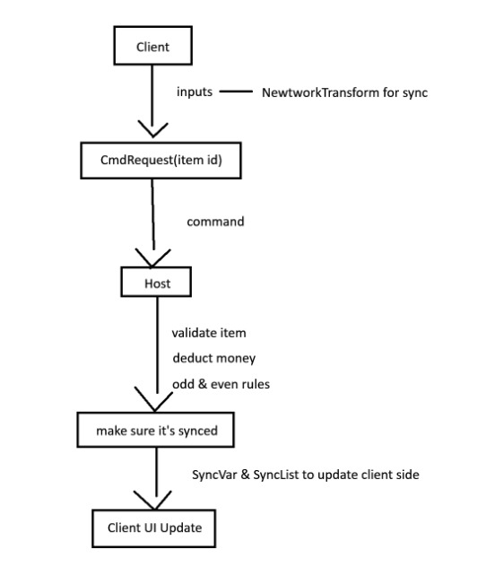

# Question 1

Örneğin çok oyunculu bir araba tamir oyununda ayrım tek bir soruya dayanır: oyuna sonradan katılan (ya da alt-tab yapıp geri dönen) bir oyuncunun bu bilgiyi bilmesi gerekiyor mu? Cevap evetse **SyncVar**, sadece bir anlık duyusal an ise **RPC** kullanılır.

### Kalıcı durum (state) olan her şey için SyncVar kullanın:
* Her parçanın hasar/aşınma seviyesi (motor, fren, lastik)
* Hangi parçaların takılı olduğu, hangilerinin eksik olduğu
* Devam eden bir işin tamir yüzdesi
* İş panosundaki görev/sipariş durumu (bekliyor, devam ediyor, tamamlandı)
* Araca uygulanmış boya rengi veya diğer kozmetik değişiklikler
* Şu an kuşanılan alet, çünkü UI ve animasyonlar bunun herkes için (yeni bağlanan gözlemciler dahil) doğru olmasına bağlı

Bunların hepsinin, yeni bir client bağlandığı an doğru olması gerekir. SyncVar bunu otomatik halleder çünkü Mirror, geç katılanlara güncel değerleri yeniden gönderir.

### Kalıcı bir durum bırakmayan tek seferlik olaylar için RPC kullanın:
* Cıvata sıkılırken çıkan anahtar sesi veya kıvılcım efekti
* Kriko kayarken ekran sarsıntısı
* Yağ sıçrama efekti
* Kişisel bir "parça takıldı!" bildirimi — bu özellikle TargetRpc ister çünkü sadece tek bir oyuncuya yöneliktir
* Motor çalıştığında bir kere çalan gaz sesi
* Araba alarmının tetiklenmesi — herkes o an duymalı ama sonradan hatırlanması gereken bir şey yok

Bunlar birer gerçek değil, birer andır. Beş dakika sonra sunucuya katılan hiç kimsenin bir kıvılcımın uçtuğunu bilmesine gerek yoktur.

### Host-validated bir yapıda bu ikisi nasıl birleşir:
Client, niyetini bir Command olarak gönderir (cıvatayı sıkmak, parça takmak istediğini vb.), server bunu doğrular (oyuncu gerçekten arabanın yanında mı, parça elinde mi, bu işlem kurallara uygun mu), ardından server ilgili SyncVar'ı günceller (cıvata durumu, takılan parça) ve sadece geri bildirim amacıyla bir RPC tetikler (ses, görsel efekt). 

Durum değişikliği ile o eylemin "hissi" bilinçli olarak birbirinden ayrılır: durum kalıcı olmalı ve senkronize edilmeli, geri bildirimin ise buna ihtiyacı yoktur ve olmamalıdır.

---

# Question 2

### İstemcinin Fiyat Belirlemesi (price parametresi):
En kritik güvenlik açığıdır. Bellek (RAM) manipülasyonu araçlarıyla (Cheat Engine vb.), tersine mühendislikle veya doğrudan ağ paketi enjeksiyonuyla istemci bu değeri manipüle edebilir. price değerini 0 yaparak tüm eşyaları ücretsiz alabilir; daha da kötüsü, negatif bir değer (örn. -999999) göndererek gold -= price işlemi üzerinden sınırsız para üretebilir. Fiyat asla istemciden parametre olarak alınmaz; sunucudaki veri kaynağından (ScriptableObject, DB) çekilmelidir.

### Bakiye Doğrulaması (Balance Check) Eksikliği:
Oyuncunun mevcut altını ile eşyanın gerçek bedeli kıyaslanmıyor. Yeterli parası olmayan oyuncu eşyayı alabilir ve bakiyesi negatif değerlere düşebilir.

### itemId Validasyonunun Olmaması:
İstemcinin gönderdiği ID'nin veritabanında var olup olmadığı, satılık bir eşya olup olmadığı ya da oyuncunun kilit açma şartlarını karşılayıp karşılamadığı denetlenmiyor. Geçersiz bir ID sunucu tarafında exception fırlatabilir; admin/test eşyalarının ID'leri gönderilerek haksız avantaj sağlanabilir.

### Mesafe ve Durum Doğrulaması (Proximity Check) Eksikliği:
Oyuncunun gerçekten ilgili NPC veya pazar alanının yakınında olup olmadığı kontrol edilmiyor. Oyuncu haritanın herhangi bir yerinden doğrudan bu RPC'yi tetikleyerek "uzaktan satın alma" istismarı yapabilir.

### Envanter Kapasite Kontrolü Yok:
Envanterde boş slot olup olmadığı denetlenmeden inventory.Add() çağrılıyor; bu durum veri kaybına ya da taşma hatalarına yol açar.

### Spam / Rate-Limiting Koruması Yok:
İstemcinin bu metodu tek bir karede yüzlerce kez çağırmasını engelleyen bir debounce/cooldown mekanizması bulunmuyor.

---

# System Flowchart

Aşağıdaki şema; istemci-sunucu (Client-Server) mimarisi, mesafe/tetikleyici kontrolü, sıfır-güven (zero-trust) satın alma doğrulama hattı, tek/çift (Odd/Even) envanter dağıtım kuralı ve durum senkronizasyonunun (State Sync) uçtan uca işleyişini göstermektedir:

