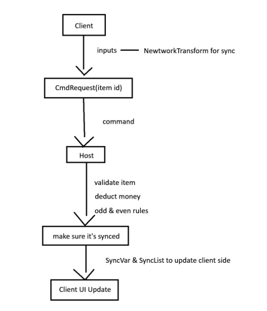

# Question 1

Örneğin çok oyunculu bir araba tamir oyununda ayrım tek bir soruya dayanır: oyuna sonradan katılan (ya da alt-tab yapıp geri dönen) bir oyuncunun bu bilgiyi bilmesi gerekiyor mu? Cevap evetse **SyncVar**, sadece bir anlık duyusal an ise **RPC** kullanılır.

### Kalıcı durum (state) olan her şey için SyncVar kullanın:
* Her parçanın hasar/aşınma seviyesi (motor, fren, lastik)
* Hangi parçaların takılı olduğu, hangilerinin eksik olduğu
* Devam eden bir işin tamir yüzdesi
* İş panosundaki görev/sipariş durumu (bekliyor, devam ediyor, tamamlandı)
* Araca uygulanmış boya rengi veya diğer kozmetik değişiklikler
* Şu an kuşanılan alet, çünkü UI ve animasyonlar bunun herkes için (yeni bağlanan gözlemciler dahil) doğru olmasına bağlı

Bunların hepsinin, yeni bir client bağlandığı an doğru olması gerekir. SyncVar bunu otomatik halleder çünkü Mirror, geç katılanlara güncel değerleri yeniden gönderir.

### Kalıcı bir durum bırakmayan tek seferlik olaylar için RPC kullanın:
* Cıvata sıkılırken çıkan anahtar sesi veya kıvılcım efekti
* Kriko kayarken ekran sarsıntısı
* Yağ sıçrama efekti
* Kişisel bir "parça takıldı!" bildirimi — bu özellikle TargetRpc ister çünkü sadece tek bir oyuncuya yöneliktir
* Motor çalıştığında bir kere çalan gaz sesi
* Araba alarmının tetiklenmesi — herkes o an duymalı ama sonradan hatırlanması gereken bir şey yok

Bunlar birer gerçek değil, birer andır. Beş dakika sonra sunucuya katılan hiç kimsenin bir kıvılcımın uçtuğunu bilmesine gerek yoktur.

### Host-validated bir yapıda bu ikisi nasıl birleşir:
Client, niyetini bir Command olarak gönderir (cıvatayı sıkmak, parça takmak istediğini vb.), server bunu doğrular (oyuncu gerçekten arabanın yanında mı, parça elinde mi, bu işlem kurallara uygun mu), ardından server ilgili SyncVar'ı günceller (cıvata durumu, takılan parça) ve sadece geri bildirim amacıyla bir RPC tetikler (ses, görsel efekt). 

Durum değişikliği ile o eylemin "hissi" bilinçli olarak birbirinden ayrılır: durum kalıcı olmalı ve senkronize edilmeli, geri bildirimin ise buna ihtiyacı yoktur ve olmamalıdır.

---

# Question 2

### İstemcinin Fiyat Belirlemesi (price parametresi):
En kritik güvenlik açığıdır. Bellek (RAM) manipülasyonu araçlarıyla (Cheat Engine vb.), tersine mühendislikle veya doğrudan ağ paketi enjeksiyonuyla istemci bu değeri manipüle edebilir. price değerini 0 yaparak tüm eşyaları ücretsiz alabilir; daha da kötüsü, negatif bir değer (örn. -999999) göndererek gold -= price işlemi üzerinden sınırsız para üretebilir. Fiyat asla istemciden parametre olarak alınmaz; sunucudaki veri kaynağından (ScriptableObject, DB) çekilmelidir.

### Bakiye Doğrulaması (Balance Check) Eksikliği:
Oyuncunun mevcut altını ile eşyanın gerçek bedeli kıyaslanmıyor. Yeterli parası olmayan oyuncu eşyayı alabilir ve bakiyesi negatif değerlere düşebilir.

### itemId Validasyonunun Olmaması:
İstemcinin gönderdiği ID'nin veritabanında var olup olmadığı, satılık bir eşya olup olmadığı ya da oyuncunun kilit açma şartlarını karşılayıp karşılamadığı denetlenmiyor. Geçersiz bir ID sunucu tarafında exception fırlatabilir; admin/test eşyalarının ID'leri gönderilerek haksız avantaj sağlanabilir.

### Mesafe ve Durum Doğrulaması (Proximity Check) Eksikliği:
Oyuncunun gerçekten ilgili NPC veya pazar alanının yakınında olup olmadığı kontrol edilmiyor. Oyuncu haritanın herhangi bir yerinden doğrudan bu RPC'yi tetikleyerek "uzaktan satın alma" istismarı yapabilir.

### Envanter Kapasite Kontrolü Yok:
Envanterde boş slot olup olmadığı denetlenmeden inventory.Add() çağrılıyor; bu durum veri kaybına ya da taşma hatalarına yol açar.

### Spam / Rate-Limiting Koruması Yok:
İstemcinin bu metodu tek bir karede yüzlerce kez çağırmasını engelleyen bir debounce/cooldown mekanizması bulunmuyor.

---

# System Flowchart

Aşağıdaki şema; istemci-sunucu (Client-Server) mimarisi, mesafe/tetikleyici kontrolü, sıfır-güven (zero-trust) satın alma doğrulama hattı, tek/çift (Odd/Even) envanter dağıtım kuralı ve durum senkronizasyonunun (State Sync) uçtan uca işleyişini göstermektedir:

---

# Epic Online Services (EOS) & Mirror Complete Integration

Bu proje, geleneksel IP/Port port-forwarding gereksinimini ortadan kaldırarak **Mirror 96.0.1** ağ katmanını **Epic Online Services (EOS) P2P Transport** ile tam uyumlu hale getirmiştir. Oyuncular küresel ölçekte **Product User ID (PUID)** üzerinden NAT punchthrough ve Epic Relay sunucuları aracılığıyla birbirlerine bağlanabilirler.

> [!NOTE]
> Detaylı mimari açıklamalar, kaynak kod referansları ve güvenlik incelemeleri için lütfen **[EOS_INTEGRATION_GUIDE.md](file:///c:/Users/T_CJ/JustAGame%20Ventures%20Case/EOS_INTEGRATION_GUIDE.md)** belgesini inceleyin.

---

## Temel Özellikler & Eklenen Sistemler

### 1. Kimlik Doğrulama & Çoklu Hesap Yönetimi (EOSLoginUI & SteamAuthManager)
* **Steam Authentication (Modern WebApi Session Ticket)**: Steam istemcisi üzerinden `SteamUser.GetAuthTicketForWebApi("epiconlineservices")` çağrısıyla alınan oturum bileti `ExternalCredentialType.SteamSessionTicket` (18) ile EOS Connect arayüzüne iletilir. Valve ve Epic sunucuları arasında özel şifreleme anahtarı gerektirmeden doğrulanır.
* **Quick Guest Login (Device ID)**: Windows donanım anahtarı üzerinden tek tıkla oturum açma (`Connect.CreateDeviceId`).
* **DevAuthTool Desteği**: Tek bir PC'de birden fazla istemciyi (`Player1`, `Player2`) test edebilmek için yerel geliştirici kimlik sunucusu desteği (`127.0.0.1:7878`).
* **Epic Games Hesabı (EAS)**: Web tarayıcısı üzerinden resmi Epic Games OAuth / Account Portal oturumu açma.
* **14 Saniye Watchdog Koruması**: Ağ kopması veya iptal edilen tarayıcı pencerelerinde arayüzün kilitlenmesini engelleyen zaman aşımı güvencesi.

### 2. Yürüme Mesafesi Takibi & EOS Cloud Stats (EOSPlayerStatsTracker)
* İstemci-yetkili yürüme mesafesi yerel oyuncudan (`ClientAuthoritativeMovement`) anlık toplanır.
* Ağ yükünü ve API limitlerini korumak için her **5 metrede bir** EOS Stats arayüzüne (`DISTANCE_WALKED`) toplu paket halinde iletilir.
* Çift yönlü kalıcılık: Veriler `PlayerPrefs` üzerinde saklanır ve sonraki girişlerde buluttaki verilerle uzlaştırılarak anında geri yüklenir.

### 3. 3 Durumlu Mesafe Görsel Göstergesi (PlayerDistanceUI)
Ekrandaki yürüme mesafesi metni TextMeshPro ile 3 farklı renk durumunda güncellenir:
* 🔴 **Kırmızı** (`#FF5555`): 100 metrenin altında (Tamamlanmadı).
* 🟡 **Sarı** (`#FFDD44`): 100 metre yerel olarak aşıldı, EOS bulut onay süreci devam ediyor.
* 🟢 **Yeşil** (`#55FF55`): `WALK_100M` başarımı EOS bulutunda başarıyla kilitlendi ve doğrulandı.

### 4. Kayan Başarım Bildirimi (AchievementNotificationUI)
* Unity Editor içinde Epic'in yerel arayüzünün (`Failed to subclass window`) devre dışı kalması sorununu çözer.
* Ekrandan bağımsız, en üst katmanda (`sortingOrder = 999`) çalışan `AchievementOverlayCanvas` üretir.
* 100 metre milestone'u tamamlandığında altın çerçeveli, 56x56 kupa ikonlu şık bir bildirim yukarıdan yumuşak bir animasyonla kayarak gelir, 4 saniye görünür kalır ve yukarı kayarak kapanır.

### 5. Sıfır-Güven Taşıma Güvenliği & SDK v1.19.2.1 Yükseltmesi
* **Resmi EOS SDK v1.19.2.1 Yükseltmesi**: Eski v1.13 kütüphanesindeki `cmp ecx, 15` credential validasyon sınırını aşmak için resmi EOS SDK v1.19.2.1 x64 kütüphanesine (`19,548,600` bayt) yükseltilmiştir (`SteamSessionTicket = 18`).
* **Bağlantı Gaspı (Hijacking) Engeli**: Bilinmeyen PUID'lerin paket göndermesini engelleyen dinamik `ConnectionFilter` ve anında `CloseConnection` reddi.
* **Kimlik Sahteciliği (Spoofing) Engeli**: Fiziksel ağ soket adresini bildirilen PUID ile doğrulayan anti-spoofing `EOSNetworkAuthenticator`.
* **Bellek & GC Optimizasyonu**: Tek parça paketler için sıfır-tahsisli (zero-allocation) hızlı dönüş yolu.
* **Oturum İzolasyonu**: Her maç başlatıldığında üretilen rastgele `MatchSessionSocketName` ile eski paketlerin yeni oturumlara sızması engellenmiştir.

### 6. Otomat Ekonomisi (VendingMachine)
* Mesafe denetimi (`Proximity Guard`), bakiye ve katalog doğrulaması sunucu tarafında yapılır.
* **Tek Numaralı Ürünler (1, 3)**: Satın alan oyuncunun envanterine eklenir.
* **Çift Numaralı Ürünler (2, 4)**: Host oyuncunun envanterine yönlendirilir.

---

## Kontroller & Geliştirici Kısayolları

| Tuş / Menü | İşlev |
| :--- | :--- |
| **`W, A, S, D`** | Oyuncu Hareketi |
| **`E`** | Otomat (Vending Machine) Etkileşimi |
| **`F7`** | Kayan başarım bildirim animasyonunu anında test etme / önizleme |
| **`F9`** | Yerel yürüme mesafesi önbelleğini sıfırlama (0m / Kırmızı duruma döndürme) |
| **`EOS Tools > Reset Local Walking Distance Cache`** | Unity Editor üst menüsünden yerel yürüme önbelleğini silme |
| **`EOS Tools > Reset Guest Device ID`** | Windows keychain üzerindeki Device ID'yi silerek yepyeni 0m Guest kullanıcı oluşturma |
| **`EOS Tools > Print Current Player PUID`** | Aktif PUID'yi konsola yazdırma ve panoya kopyalama |

---

## Hızlı Başlangıç & Doğrulama Rehberi

### 1. Unity Editor İçi Anlık Doğrulama (Tek Kişilik Host):
1. Steam girişini tamamlayıp EOS P2P menüsü açıldıktan sonra **Host (P2P)** butonuna tıklayın.
2. Karakterinizin sahnede doğduğunu (`Host Mode`) gözlemleyin.
3. `WASD` ile yürüyün: `PlayerDistanceUI` metninin 🔴 Kırmızı başladığını, her 5 metrede bir konsola EOS Stats ingest logunun düştüğünü görün.
4. `100.0m` mesafeye ulaşıldığında (veya `F7` tuşuna basıldığında) altın kupa bildiriminin yukarıdan yumuşakça kaydığını ve metnin 🟢 Yeşile döndüğünü doğrulayın.
5. Otomatın yanına gidip `E` tuşuna basın. Tek/Çift ürün satın alımlarını test edin.

### 2. Tek PC'de İki İstemci Testi (Steam Host + Guest Client):
1. **Host (Unity Editor)**: Steam ile giriş yapın, **Host (P2P)** butonuna tıklayın ve ekranda beliren PUID'yi kopyalayın.
2. **Build Oluşturma**: Unity'de `File > Build Settings` üzerinden `Build and Run` diyerek oyunu derleyin (`Build/EOSGame.exe`).
3. **Client (Standalone Build)**: Açılan pencerede **Quick Guest Login (Device ID)** butonuna tıklayın.
4. Kopyaladığınız Host PUID'sini metin kutusuna yapıştırıp **Connect (P2P)** butonuna tıklayın.
5. Her iki karakterin aynı dünyada birbirini gördüğünü, hareketlerin senkronize olduğunu ve otomat alışverişlerini doğrulayın.
